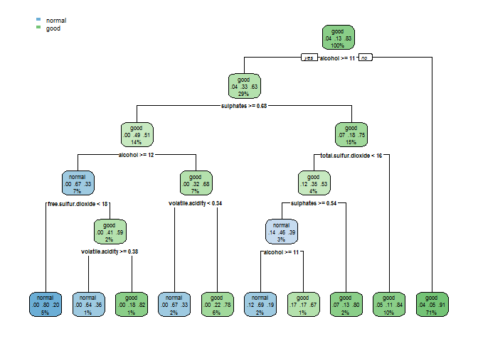
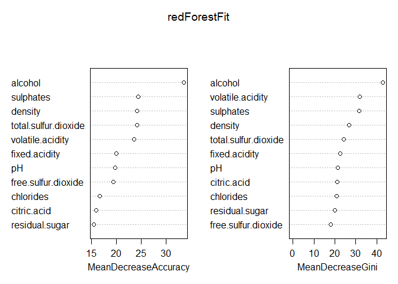
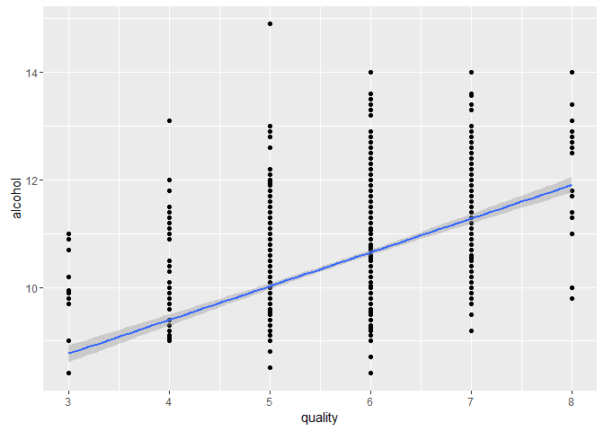
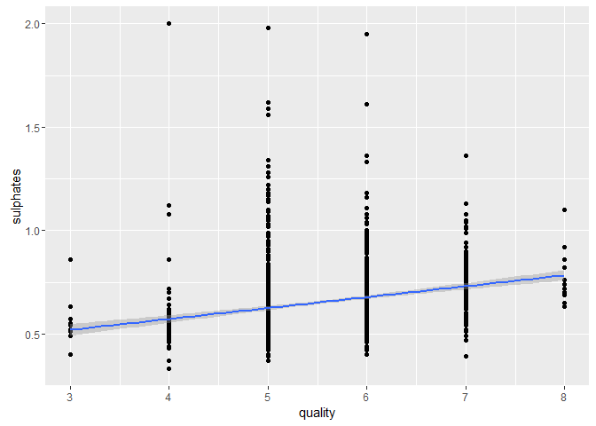
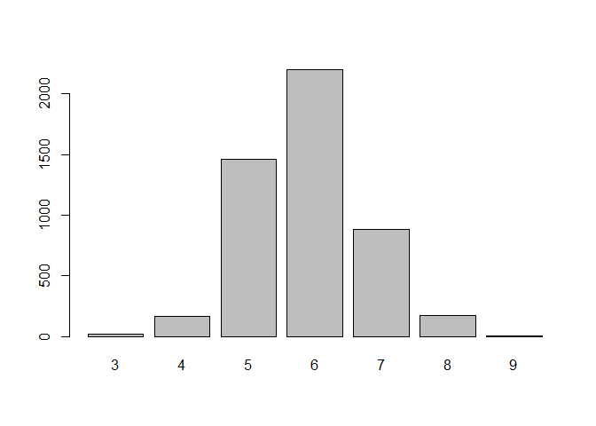
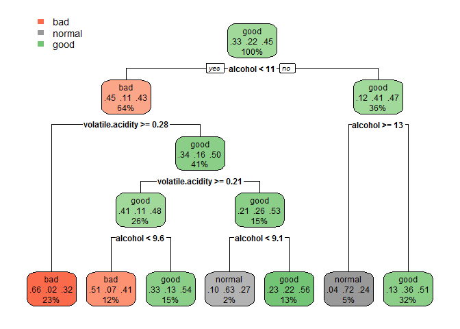
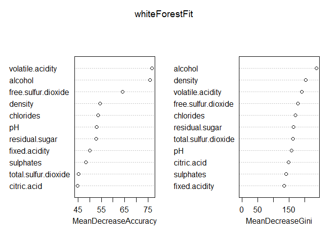
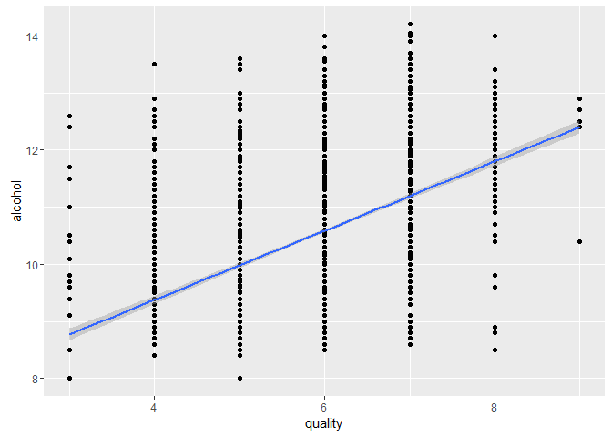
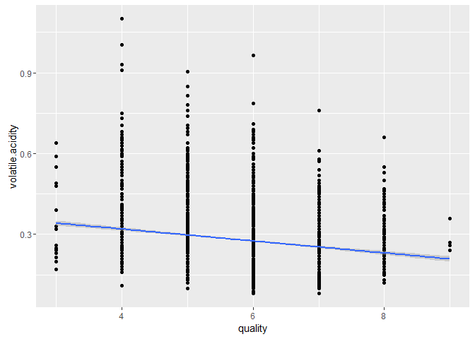

# Exploratory Analysis of the Portugal Wine Dataset
Kier Groulx  


# Notes

As an exercise in classification and regression, here is a Wine quality analysis from northern Portugal. For privacy reasons, there is no data about brand, grape type, price, or any other personally identifying information. Only measurable physiochemical data is included, as well as a rating of the wine's quality.
The data was obtained from <http://archive.ics.uci.edu/ml/datasets/Wine+Quality>.


```r
library(randomForest)
library(ggplot2)
library(rattle)
library(rpart)
library(rpart.plot)
library(RColorBrewer)
```

To begin with, we have to start by reading in the data from the website.  There are two datasets here - one for red wine and one for white wine; we will start with the red wine dataset.  While read.csv() is often one of the first input functions taught to people trying to immerse themselves in data science, here it will prove suboptimal to use.  The reason for this is that read.csv will read in this numerical data by default as a factor.  While there are ways to unclass the information into a numerical output, there are a few pitfalls (i.e., unclassing the factors directly won't return the underlying numericals, it will output factor levels that are numerical but differ from the data).  To avoid all of this, we can use read.table() and import directly from the URL online.  


```r
url <- 'https://archive.ics.uci.edu/ml/machine-learning-databases/wine-quality/winequality-red.csv'
red <- read.table(url, sep = ';', header = TRUE)
```

Next, get a quick look at how the data is working out, and then look at the distribution of wine qualities that are included in the data.  

```r
head(red)
```

```
##   fixed.acidity volatile.acidity citric.acid residual.sugar chlorides
## 1           7.4             0.70        0.00            1.9     0.076
## 2           7.8             0.88        0.00            2.6     0.098
## 3           7.8             0.76        0.04            2.3     0.092
## 4          11.2             0.28        0.56            1.9     0.075
## 5           7.4             0.70        0.00            1.9     0.076
## 6           7.4             0.66        0.00            1.8     0.075
##   free.sulfur.dioxide total.sulfur.dioxide density   pH sulphates alcohol
## 1                  11                   34  0.9978 3.51      0.56     9.4
## 2                  25                   67  0.9968 3.20      0.68     9.8
## 3                  15                   54  0.9970 3.26      0.65     9.8
## 4                  17                   60  0.9980 3.16      0.58     9.8
## 5                  11                   34  0.9978 3.51      0.56     9.4
## 6                  13                   40  0.9978 3.51      0.56     9.4
##   quality
## 1       5
## 2       5
## 3       5
## 4       6
## 5       5
## 6       5
```

```r
str(red)
```

```
## 'data.frame':	1599 obs. of  12 variables:
##  $ fixed.acidity       : num  7.4 7.8 7.8 11.2 7.4 7.4 7.9 7.3 7.8 7.5 ...
##  $ volatile.acidity    : num  0.7 0.88 0.76 0.28 0.7 0.66 0.6 0.65 0.58 0.5 ...
##  $ citric.acid         : num  0 0 0.04 0.56 0 0 0.06 0 0.02 0.36 ...
##  $ residual.sugar      : num  1.9 2.6 2.3 1.9 1.9 1.8 1.6 1.2 2 6.1 ...
##  $ chlorides           : num  0.076 0.098 0.092 0.075 0.076 0.075 0.069 0.065 0.073 0.071 ...
##  $ free.sulfur.dioxide : num  11 25 15 17 11 13 15 15 9 17 ...
##  $ total.sulfur.dioxide: num  34 67 54 60 34 40 59 21 18 102 ...
##  $ density             : num  0.998 0.997 0.997 0.998 0.998 ...
##  $ pH                  : num  3.51 3.2 3.26 3.16 3.51 3.51 3.3 3.39 3.36 3.35 ...
##  $ sulphates           : num  0.56 0.68 0.65 0.58 0.56 0.56 0.46 0.47 0.57 0.8 ...
##  $ alcohol             : num  9.4 9.8 9.8 9.8 9.4 9.4 9.4 10 9.5 10.5 ...
##  $ quality             : int  5 5 5 6 5 5 5 7 7 5 ...
```

```r
barplot(table(red$quality))
```

<!-- -->

As we can see, the dataset roughly follows a normal distribution.  We might infer that, while a wine critic may give a more detailed score, the general public with a less refined palate may just assign a simpler categorical label based on critic reviews - 'good', 'normal', or 'bad'.  The cutoffs for this 'critic' parameter can vary, but for now we'll use the ones outlined below.  It's important that we recast this from a string back into a factor, since we'll want to do some operations and analyses on it very soon.


```r
red$critic <- ifelse(red$quality < 5, 'bad','good')
red$critic[red$quality > 4 & red$quality < 7] <- 'normal'
red$critic <- as.factor(red$critic)
levels(red$critic) = c('bad','normal','good')
```

While we have recast the quality into a more easily measurable term, the fact remains that we currently do not know how the quality metric was obtained.  It is true that a significant portion of a quality metric may be determined by data that we do not have here - the vineyard producing the wine, the grapes used, the price per bottle of the wine, and so forth.  However, rather than turning this into a discussion of brand recognition and price justification, can we make an inference on quality based solely on the physiochemical properties of each wine?

To start with, we can first divide up the red wine dataset into a training and a testing set of data.  If we pretend that we do not have the 'quality' or 'critic' parameters for the test data, any model that we generate to explain these parameters in our training data can then be run for accuracy against our test data.  We set the seed here such that the results reported here are reproducible.


```r
set.seed(123)
redsub <- sample(nrow(red), 0.6 * nrow(red))
redtrain <- red[redsub,]
redtest <- red[-redsub,]
```

Now that we have divided up our dataset into training and test cases, we can turn to creating a decision tree, based on the rpart and rpart.plot packages we imported earlier.  We instruct our tree to infer a critic score based on all of the other parameters in the data set, since all of these parameters are physiochemical measures of the wine.  We leave out the 'quality' parameter, since it directly correlates with the critic parameter we have set up.


```r
redTreeFit <- rpart(critic ~ . - quality, data=redtrain)
rpart.plot(redTreeFit)
```

<!-- -->

This tree works by identifying the most salient variables that, when split, will differentially classify wines.  By default, this does not identify every instance of wine (i.e. there are not unique bins for every datapoint in the set), as this would most likely overfit the data.  We do not want our model to be looking for patterns where none exist! We want it instead to be finding the most salient patterns and then work from there.  Parameters do exist to make our decision tree classify more or less content, but for now, let's stick with the defaults.

Here we notice two things:

1. There are several decisions made about parameters that we may not have been paying attention to.  This is the rpart package at work, identifying patterns in the data beyond what we may be sensitive to.  It may turn out that we need to conduct factor analysis on this (perhaps levels of free sulfur dioxide are proven not to affect wine quality, but just naturally vary?), but until we limit that analysis based on human expertise, it is a pattern that the algorithm has detected.

2. None of our bins classify into our 'bad' category.  The reason for this is that the 'critic' parameter we created earlier does not have bins of roughly equal size.  In fact, we may have been too lenient in categorizing wines before.  For our next dataset of white wines, perhaps we can be a bit harsher on wines in order to diversify our tree more.


```r
table(redtrain$critic)
```

```
## 
##    bad normal   good 
##     39    125    795
```

Despite these limitations, let's generate a prediction from our tree of the training dataset and see how well it predicts our test values.


```r
redTreePredict <- predict(redTreeFit, newdata = redtest, type = "class")
table(redTreePredict,redtest$critic)
```

```
##               
## redTreePredict bad normal good
##         bad      0      0    0
##         normal   0     36   24
##         good    24     56  500
```

How well did our model do in predicting the new data?  We can calculate this by summing the diagonal of our generated table (which shows where our predictions matched the actual data) and divide by the total number of observations.


```r
sum(diag(table(redTreePredict,redtest$critic)))/nrow(redtest)
```

```
## [1] 0.8375
```

Our model does turn out to be fairly accurate.  Since our 'critic' parameter is a  categorical variable consisting of several numerical values, our model will necessarily be more accurate than one where predictions are made on the numerical 'quantity' parameter.  However, we earlier assumed that the layperson who drinks wine may only be able to accurately categorize wine as being in one of these categories, rather than consistently assigning a value from 1-10 for each wine.  Therefore, the extra information lost from the numerical categories can be deemed an acceptable loss, and this model may be of more use to the layperson.

How else might we be able to make a predictive inference about this data?  One method of this is to construct a random decision forest for the data.  This ensemble method constructs several of these decision trees that each look at a subset of the given training data and use a subset of the rules from our initial decision tree.  When all trees have been computed, we can take the mode of classification values across all trees and use that as our (hopefully better) prediction value for our test cases.


```r
redForestFit <- randomForest(critic ~ . - quality,importance=TRUE,data=redtrain)
varImpPlot(redForestFit)
```

<!-- -->

These two plots provide a measure of variable importance in the random forest.  Essentially, the mean decrease in accuracy shows the amount of predictive accuracy falloff if each variable was independently removed.  The mean decrease in GINI coefficient demonstrates the same thing, but looks less at accuracy and more at the efficacy of each variable as a determinant for bin splitting.  If a variable can initiate a split that creates two bins that each have a high degree of categorical purity compared to the previous bin, then the variable provides a high amount of GINI importance.  In general, this metric is not as efficient as the mean decrease in accuracy for understanding variable importance.

Let's now make a new prediction on our testing data, given our predictors from our random forest.


```r
redForestPredict <- predict(redForestFit, newdata = redtest, type = "class")
table(redForestPredict,redtest$critic)
```

```
##                 
## redForestPredict bad normal good
##           bad      0      0    0
##           normal   0     49   11
##           good    24     43  513
```

So, how does this random forest prediction measure up against our decision tree prediction?


```r
sum(diag(table(redForestPredict,redtest$critic)))/nrow(redtest)
```

```
## [1] 0.878125
```

About a 4% increase in accuracy!  Not too shabby, especially since the decision tree was already performing fairly well to begin with.

Given that we have conducted some exploratory analyses on this dataset so far, the next step may be to conduct a factor analysis on the variables that are present.  As the author is not incredibly well versed on winemaking or analysis, picking out the details between the effects of free and total sulfur dioxide will have to wait until later.  However, we may notice that two factors in particular stand out amongst both our decision trees and random forest - alcohol and sulphates (sulfites).  We can take a closer look at both of these values and how they correlate with a wine's perceived quality.


```r
qplot(quality, alcohol, data = red) + geom_smooth(method = "lm")
```

<!-- -->

```r
qplot(quality, sulphates, data = red) + geom_smooth(method = "lm")
```

<!-- -->

While both parameters have a higher variance around the middling values due to higher amounts of data points, it seems that both alcohol and sulphates have a slight positive trend with quality.  It may be easy to extrapolate why a higher % of alcohol by volume may result in a perceived increase in quality, but sulphates may be a bit harder to understand.  Sulphates in wine act as a preservative, and wines with fewer numbers of sulphates may be prone to oxidize quicker and therefore develop less desirable tastes quicker.  While sulphate numbers are regulated in the EU, white wines are allowed to have a higher number of sulphates than red wines.  Due to their diminished number, sulphates in red wine may play a stronger role than sulphates in white wine, and may be more vital to ensure the freshness of the wine.  While this can't be taken without consideration (we can't just dump more alcohol and sulphates to the wine and get a stellar review!), these trends may indicate a % value of alcohol and sulphates that we can converge upon to be most pleasing to wine critics.  These values may well be indicative of a general desirable flavor of red wine.

Let's do the same analysis with the white wine dataset, this time being a big more lax on our constrictions such that we get more variable 'critic' categories.


```r
url <- 'https://archive.ics.uci.edu/ml/machine-learning-databases/wine-quality/winequality-white.csv'
white <- read.table(url, sep = ';', header = TRUE)
barplot(table(white$quality))
```

<!-- -->

```r
white$critic <- ifelse(white$quality < 6, 'bad','good')
white$critic[white$quality == 6] <- 'normal'
white$critic <- as.factor(white$critic)
levels(white$critic) = c('bad','normal','good')
table(white$critic)
```

```
## 
##    bad normal   good 
##   1640   1060   2198
```

Here we notice that there's a bit more stratification in white wine reviews, so we can establish classes that have a bit more diversity.  This will make a model that seems to not be as accurate, but may be doing more work since it can't dump most of the results into the 'normal' category.


```r
set.seed(123)
whitesub <- sample(nrow(white), 0.6 * nrow(white))
whitetrain <- white[whitesub,]
whitetest <- white[-whitesub,]

whiteTreeFit <- rpart(critic ~ . - quality, data=whitetrain)
rpart.plot(whiteTreeFit)
```

<!-- -->

Our decision tree has started to classify some wine groups as bad - namely, those that aren't that alcoholic and taste more acidic than anything else. It also seems at a glance that alcohol may still be a strong determinant for white wine quality as well. 


```r
whiteTreePredict <- predict(whiteTreeFit, newdata = whitetest, type = "class")
table(whiteTreePredict,whitetest$critic)
```

```
##                 
## whiteTreePredict bad normal good
##           bad    429     20  243
##           normal  10     74   54
##           good   228    317  585
```

```r
sum(diag(table(whiteTreePredict,whitetest$critic)))/nrow(whitetest)
```

```
## [1] 0.555102
```

The accuracy results here may be disappointing compared to the red dataset, but remember that the categories have been much more stratified now.  Inferring where people may place their cutoffs is an inexact science, hence the nebulousness of the categories.  


```r
whiteForestFit <- randomForest(critic ~ . - quality,importance=TRUE,data=whitetrain)
varImpPlot(whiteForestFit)
```

<!-- -->

```r
whiteForestPredict <- predict(whiteForestFit, newdata = whitetest, type = "class")
table(whiteForestPredict,whitetest$critic)
```

```
##                   
## whiteForestPredict bad normal good
##             bad    475     12  125
##             normal  13    254   86
##             good   179    145  671
```

```r
sum(diag(table(whiteForestPredict,whitetest$critic)))/nrow(whitetest)
```

```
## [1] 0.7142857
```

That's better!

In the same vein as before, alcohol seems to be a major predictor for assessment of white wine quality.  However, the importance of sulphates has dropped, and for this example of white wine, volatile acidity seems to be important.  This may be due to the fact that white wine, when it has been left open for too long, quickly takes on an acidic vinegar-like taste which indicates that it is losing its potency.  To examine this, we can look for trends as we did before.

```r
qplot(quality, alcohol, data = white) + geom_smooth(method = "lm")
```

<!-- -->

```r
qplot(quality, volatile.acidity, data = white) + geom_smooth(method = "lm")
```

<!-- -->

As expected, white wine follows the same trend with respect to % of alcohol by volume and expected quality.  Also, volatile acidity seems to have a slightly negative trend with quality.  This may be spurious (the trend is close to 0), but it may be something to keep in consideration, considering how much this variable affected the predicted mean accuracy in our random forest.

For now, this has been a good introductory look at this wine dataset.  We can continue with more analyses down the road.
